# How to Setup External Secrets Operator (ESO) as a service

# Overview

> "The [External Secrets Operator](https://external-secrets.io/) (ESO) extends Kubernetes with `Custom Resources`, which define where secrets live and how to synchronize them. The controller fetches secrets from an external API and creates Kubernetes secrets. If the secret from the external API changes, the controller will reconcile the state in the cluster and update the secrets accordingly."
>
> &mdash; ESO Docs.

# Introduction

The External Secrets Operator (ESO) supports different modes of operations such as: [Shared ClusterSecretStore](https://external-secrets.io/v0.6.1/guides/multi-tenancy/#shared-clustersecretstore), [Managed SecretStore per Namespace](https://external-secrets.io/v0.6.1/guides/multi-tenancy/#managed-secretstore-per-namespace), [ESO as a Service](https://external-secrets.io/v0.6.1/guides/multi-tenancy/#eso-as-a-service) which is the mode of choice picked for this guide.

In an ESO as a Service setting, the operator can be deployed cluster-wide, for example in the `openshift-operators` namespace. This makes the Operator Life Cycle management easier in that only _one_ instance and a single version of the ESO is deployed in the cluster; and it is made available to all namespaces. Hence, application developers can focus on providing their workload secrets specifications using the `ExternalSecret` and `SecretStore` Custom Resources (CRs) to have their secrets pulled from the secrets provider (such as the [AWS Secrets Manager][aws-secrets-manager]).


Below diagram depicts the **ESO as a Service** setup whereby application teams manage `ExternalSecret, SecretStore` custom resources; and the platform team handles Operator installation and upgrades.

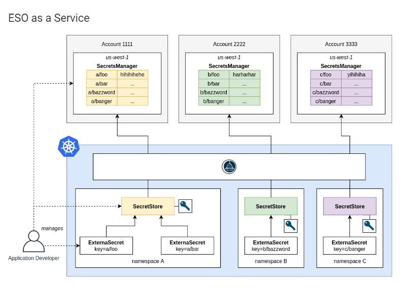

[aws-secrets-manager]: https://aws.amazon.com/secrets-manager/

## Problem Statement

This guide makes an attempt to show one of the many methods we can store "sensitive" data in an external secrets management system such as **AWS Secrets Manager**, retrieve that data via the ESO and have them stored in Kubernetes secrets for applications to use.

## Solution

To address this concern, we will leverage the ESO which will be deployed as a Service (diagram above) on a ROSA (OpenShift v4.10+) cluster. In other words, the operator custom resources (`ExternalSecret, SecretStore`) will be available to all existing and future namespaces for application developers to use.

In this guide, the `AWS Secrets Manager` is used as the secrets provider. However, with few tweaks the solution can be used with any of the providers[^1] supported by ESO.


Three (3) helm charts are utilized to deploy this solution. Furthermore, the solution simulates an enterprise deployment environment where Corporate InfoSec policies require all container images be hosted and served from a private, _internal_ registry.

The following charts are deployed in this order:

- [eso-operator-install][]: Deploys the ESO operator and its CRDs (`OperatorGroup`, `Subscription`) in the `openshift-operators` namespace.

- [eso-operator-patch][]: Two container images are needed for the operator complete setup. This chart Deploys the resources needed to apply patches to the operator. Moreover, the chart creates an `OperatorConfig` resource which references a private container image; while the `CronJob` periodically `patches` the operator `ClusterServiceVersion` (CSV) to reference another private container image.

- [eso-secrets-sync][]: Deploys the CRs (`ExternalSecret`, `SecretStore`) needed to integrate with the secrets provider, as well as creating the Kubernetes `secrets` backed by one or more `AWS Secret Manager` buckets.

    - `Secret`: Kubernetes object for storing the AWS IAM User credentials
    - `SecretStore`: ESO custom resource that references the `Secret`.
    - `ExternalSecret`: ESO custom resource for defining the relationship between AWS Secret Manager bucket's `{key, value}` pairs and the "to be" created Kubernetes secrets.

[eso-operator-install]: https://github.com/luqmanbarry/external-secrets-operator-guide/tree/master/eso-operator-install
[eso-operator-patch]: https://github.com/luqmanbarry/external-secrets-operator-guide/tree/master/eso-operator-patch
[eso-secrets-sync]: https://github.com/luqmanbarry/external-secrets-operator-guide/tree/master/eso-secrets-sync

# Prerequisites

- A running Red Hat `OpenShift` 4.7+ cluster
- Access to an AWS account
- `AWS Secrets Manager` bucket created, and required groups and policies applied
- An `IAM` user with rights to at least read secret manager buckets
- `AWS_ACCESS_KEY` and `AWS_SECRET_ACCESS_KEY` values
- An OpenShift `service account`  (SA) with edit access to deployment namespaces
- The following CLI tools
    - `podman` or `docker` or `skopeo`
    - `oc` or `kubectl`
    - `helm`

# Implementation

These Helm charts have been tested on Red Hat `OpenShift` v4.10.x.

The guide uses two example micro-services (`Product Service` and the `Shipping Service`), which will use the ESO to access and fetch "sensitive" data from the AWS Secrets Manager service.

Note that the following screenshots and code snippets intentionally show **sample** sensitive data as _examples_.

# Procedure

## I. AWS Secrets Manager Setup

### 1. Create the **AWS Secrets Manager** buckets

Product Service Empty Bucket
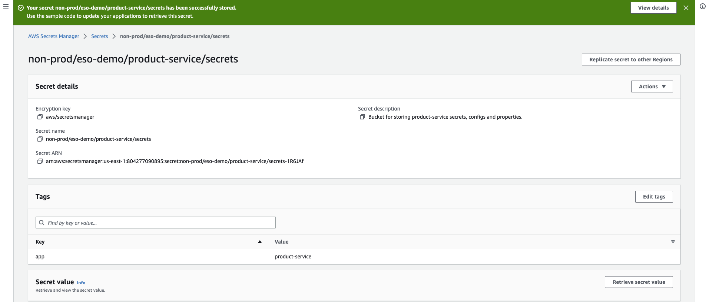


Shipping Service Empty Bucket
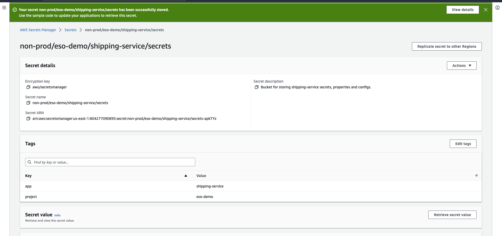


Follow [this link](https://docs.aws.amazon.com/secretsmanager/latest/userguide/getting-started.html) to learn more about the **AWS Secrets Manager** service.

### 2. Place secrets data into the buckets following the `{"key": "value"}` pair format.

> **IMPORTANT**: For multi-line strings such as certificates, properties and config files, ensure secrets values are `Base64` encoded to retain formatting. AWS Secrets Manager does not support space and newline based formatting.

For example to encode/decode a plaintext file, execute this command:

```sh
# Encode to base64
base64 < cleartextFile.txt > encodedFile.txt

# Decode from base64
base64 -d < encodedFile.txt  > cleartextFile.txt
```

**Before the secrets are stored**

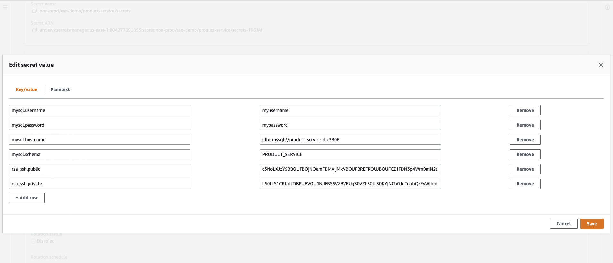


**After the secrets are stored**

Product Service Stored Secrets
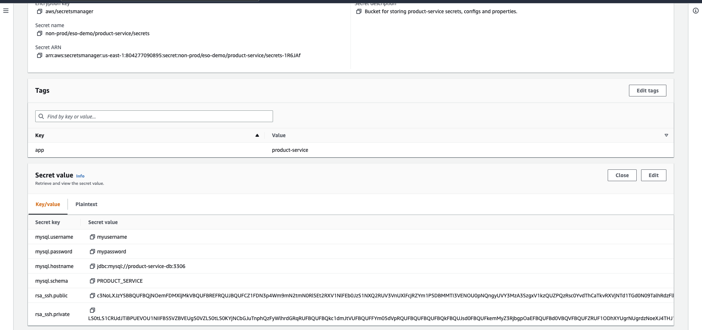

Shipping Service Stored Secrets
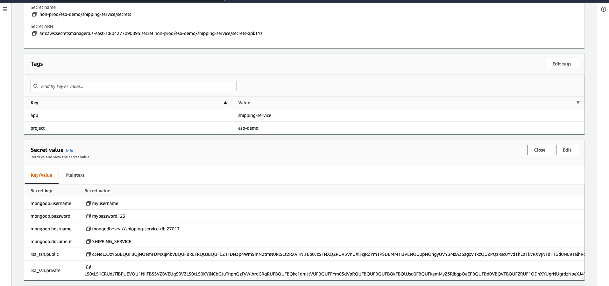


### 3. Create the AWS IAM Policy

We will create a new `eso-demo-iam` IAM User and grant it `read` access to the `non-prod/eso-demo/product-service/secrets` and `non-prod/eso-demo/shipping-service/secrets` **AWS Secrets Manager** buckets.

IAM Policy with **Read** permission to the two (2) buckets:

```json
{
  "Version": "2012-10-17",
  "Statement": [
    {
    "Sid": "VisualEditor0",
    "Effect": "Allow",
    "Action": [
      "secretsmanager:GetResourcePolicy",
      "secretsmanager:GetSecretValue",
      "secretsmanager:DescribeSecret",
      "secretsmanager:ListSecretVersionIds"
    ],
    "Resource": [
      "arn:aws:secretsmanager:us-east-1:804277090123:secret:non-prod/eso-demo/product-service/secrets-1R6JAf",
      "arn:aws:secretsmanager:us-east-1:804277090123:secret:non-prod/eso-demo/shipping-service/secrets-apkTYz"
    ]
  },
    {
    "Effect": "Allow",
    "Action": "secretsmanager:ListSecrets",
    "Resource": "*"
  }
  ]
}
```

### 4. Create the IAM User and assign it the Policy

Create the IAM user and select the credential type as `Access Key - Programmatic access`:

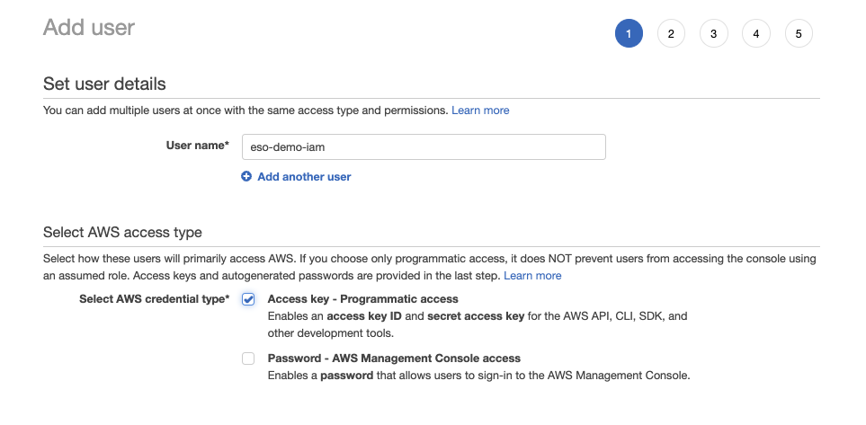

Pay close attention to the selected option on the right most tile
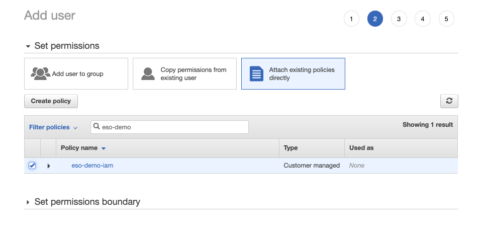

Preview the user to be created
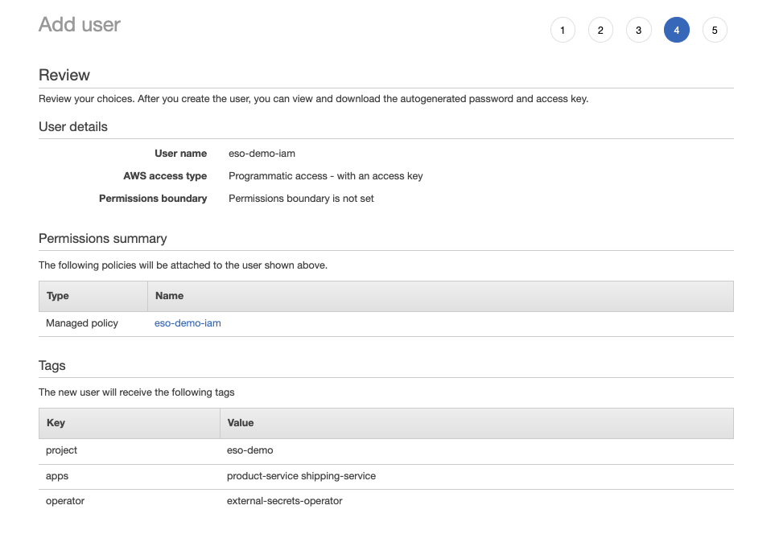

The IAM user has been created, `Access key ID` and `Secret access key` are displayed:
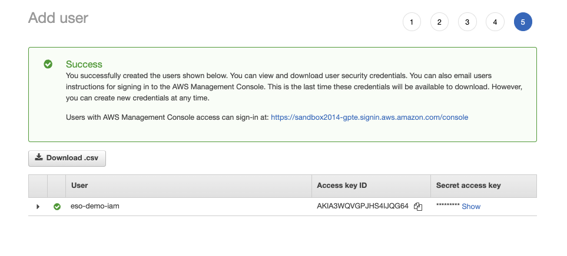

Take note of the **Access key ID** and **Secret access key** info.

--------------------------------------------------------------------------------------

## II. Deploying the External Secrets Operator using Helm

We now proceed with installing the operator and its custom resources.

The setup simulates an environment where enterprise InfoSec policy allows container images only from the corporate private registry or OpenShift's internal registry.

The [eso-operator-patch](https://github.com/luqmanbarry/external-secrets-operator-guide/tree/master/eso-operator-patch) chart is created to address this requirement. The chart deploys a `CronJob` resource, which periodically replaces the default Github container registry (`ghcr.io`) image reference defined in the `ClusterServiceVersion` (CSV) by a **private** image pushed via `skopeo` into the OpenShift cluster `eso-build` namespace.

Clone the [guide repository](https://github.com/luqmanbarry/external-secrets-operator-guide) and use the repo folder as default directory.

### 1. Create the build and deployment (demo) namespaces

```sh
# For ImageStreams
oc create namespace eso-build

# For Application deployment
oc new-project eso-demo
```

### 2. Push Operator Images to internal registry

Registry format: `<INTERNAL_REGISTRY_SVC>:<PORT>/<IMAGE_NAMESPACE>/<IMAGE_STREAM_NAME>:<IMAGE_STREAM_TAG>`

Operator Controller Manager Image:

- Public Image: `ghcr.io/external-secrets/external-secrets-helm-operator:v0.6.1`
- Internal Image: `image-registry.openshift-image-registry.svc:5000/eso-build/external-secrets-helm-operator:v0.6.1`

OperatorConfig Image:

- Public Image: `ghcr.io/external-secrets/external-secrets:v0.6.1`
- Internal Image: `image-registry.openshift-image-registry.svc:5000/eso-build/external-secrets:v0.6.1`


Before images were copied to internal registry **eso-build** namespace:
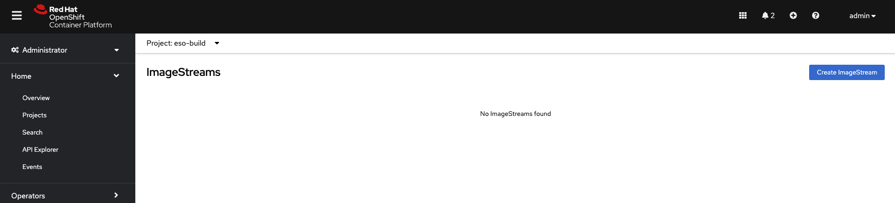

Get public route of OpenShift internal registry. Follow [this link](https://access.redhat.com/documentation/en-us/openshift_container_platform/4.10/html-single/registry/index) to learn more about internal registry for OpenShift.

```sh
# Expose registry via a Route if not available
oc patch configs.imageregistry.operator.openshift.io/cluster --patch '{"spec":{"defaultRoute":true}}' --type=merge

# Get the hostname of the registry route
REGISTRY_HOST=$(oc get route default-route -ojsonpath='{.spec.host}' -n openshift-image-registry)

echo ${REGISTRY_HOST}
```


Run `skopeo` commands to copy images from github container registry (ghcr.io) to internal registry.

```sh
# Controller Manager Image
skopeo copy docker://ghcr.io/external-secrets/external-secrets-helm-operator:v0.6.1 \
    docker://${REGISTRY_HOST}/eso-build/external-secrets-helm-operator:v0.6.1 \
    --dest-username $(oc whoami) \
    --dest-password $(oc whoami -t) \
    --override-os linux

# OperatorConfig Image
skopeo copy docker://ghcr.io/external-secrets/external-secrets:v0.6.1 \
    docker://${REGISTRY_HOST}/eso-build/external-secrets:v0.6.1 \
    --dest-username $(oc whoami) \
    --dest-password $(oc whoami -t) \
    --override-os linux
```


After images are pushed to internal registry in **eso-build** namespace:


We are now ready to deploy the operator and its custom resources.

### 3. Install the [eso-operator-install][] Helm chart

The chart creates the `Subscription` and `OperatorGroup` CRs.

The `OperatorGroup` template is **disabled** by default because it is getting deployed in the `openshift-operators` namespace, which already has this CR. Set `operator.globalOperatorGroupExists: false` in the chart file ([values.yaml][values-install]) if you want to include it in the chart deployment.

```sh
helm upgrade --install eso-operator-install ./eso-operator-install -n openshift-operators
```

After successful installation, the operator is available in `eso-demo` despite having been deployed in a different namespace.

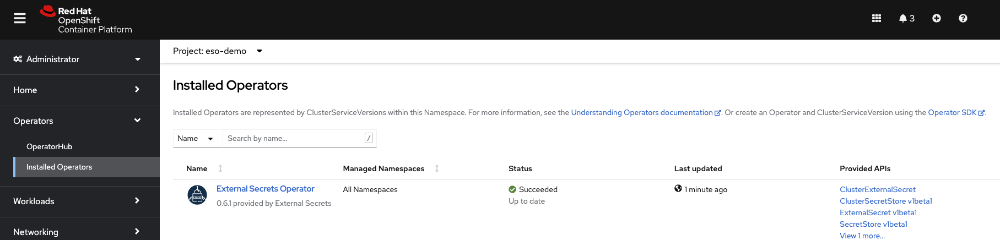

[values-install]: https://github.com/luqmanbarry/external-secrets-operator-guide/blob/master/eso-operator-install/values.yaml

### 4. Install the [eso-operator-patch][] Helm chart

Before we proceed with installing this chart, we need to grant the service accounts in the `openshift-operators` namespace the permission to pull images from `eso-build` namespace:

```sh
OPERATOR_NS=openshift-operators                               \
IMAGE_NS=eso-build                                            \
oc policy add-role-to-group                                   \
    system:image-puller system:serviceaccounts:${OPERATOR_NS} \
    --rolebinding-name=eso-image-pullers                      \
    --namespace=${IMAGE_NS}
```

Here's the [values.yaml][values-patch] file. Note the Image repositories values.

```yaml
operator:
  name: external-secrets-operator
  imagePatchCronJob:
    # The service account and associated roles must be created first.
    serviceAccountName: eso-images-patch-sa
    # CronJob will run every 5min
    patchSchedule: '*/5 * * * *'

  operatorConfig:
    deploymentName: "external-secrets-operator"
    image:
      # The original PUBLIC image repository
      #repository: ghcr.io/external-secrets/external-secrets
      # The new PRIVATE image repository -- Make sure you replace 'eso-build' with your namespace
      repository: "image-registry.openshift-image-registry.svc:5000/eso-build/external-secrets"
      pullPolicy: IfNotPresent
      tag: 'v0.6.1'

  controllerManager:
    startingCSV: external-secrets-operator.v0.6.1
    deploymentName: "external-secrets-operator-controller-manager"
    image:
      # The original PUBLIC image repository
      #repository: ghcr.io/external-secrets/external-secrets-helm-operator
      # The new PRIVATE image repository -- Make sure you replace 'eso-build' by your namespace
      repository: "image-registry.openshift-image-registry.svc:5000/eso-build/external-secrets-helm-operator"
      pullPolicy: IfNotPresent
      tag: 'v0.6.1'
```

[values-patch]: https://github.com/luqmanbarry/external-secrets-operator-guide/blob/master/eso-operator-patch/values.yaml

Install the helm chart

```sh
helm upgrade --install eso-operator-patch ./eso-operator-patch -n openshift-operators
```

After Installation:
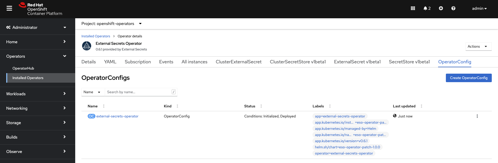

The Customer Resources created as a result:
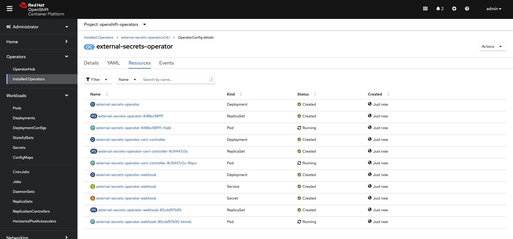

We are now ready to deploy the CRs that will synchronize the Kubernetes `secrets` from **AWS Secrets Manager**.

--------------------------------------------------------------------------------------

## III. Secrets Synchronization

The [eso-secrets-sync][] chart will deploy the `ExternalSecret` and `SecretStore`, which will:

1. Authenticate to AWS using the `eso-demo-iam` IAM User, and
2. Fetch and create kubernetes `Secrets` as specified in the [values.yaml][values-sync] file.

Each list item under `provider.aws.externalSecrets.apps` references one application or an AWS Secrets Manager bucket.

{>>Replace the access keys with junk/random values<<}

For example:

```yaml
provider:
  aws:
    region: us-east-1
    accessKey: "<YOUR_ACCESS_KEY_HERE>"
    secretAccessKey: "<YOUR_SECRET_ACCESS_KEY_HERE>"
    authSecretName: eso-aws-authn-secret
    externalSecrets:
      apps:
      - name: product-service
        enabled: true
        project: eso-demo
        # Default value is 1h
        refreshInterval: 30m
        # Possible Values: "Opaque", "kubernetes.io/dockerconfigjson", "kubernetes.io/tls", "kubernetes.io/ssh-auth"
        secretType: Opaque
        localSecretName: product-service-secret
        remoteSecretBucket: "non-prod/eso-demo/product-service/secrets"
        keySets:
        # templateKey: Replace dots(.) by underscores; use snake case(substr1_substr2_substr3)
        - remoteKey: "mysql.username"
          isRemoteValueB64Encoded: false
          templateKey: "mysql_username"
          localSecretKey: "mysql.username"
      - name: shipping-service
        enabled: true
        project: eso-demo
        # Default value is 1h
        refreshInterval: 10m
        # Possible Values: "Opaque", "kubernetes.io/dockerconfigjson", "kubernetes.io/tls", "kubernetes.io/ssh-auth"
        secretType: Opaque
        localSecretName: shipping-service-secret
        remoteSecretBucket: "non-prod/eso-demo/shipping-service/secrets"
        keySets:
        # templateKey: Replace dots(.) by underscores; use snake case(substr1_substr2_substr3)
        - remoteKey: "mongodb.username"
          isRemoteValueB64EncodedIn: false
          templateKey: "mongodb_username"
          localSecretKey: "mongodb.username"
```

[values-sync]: https://github.com/luqmanbarry/external-secrets-operator-guide/blob/master/eso-secrets-sync/values.yaml

## 1. Install the [eso-secrets-sync][] chart

The chart is deployed alongside the application workloads that are going to use the generated `secrets` objects. In this example the namespace is `eso-demo`.

Before chart deployment:
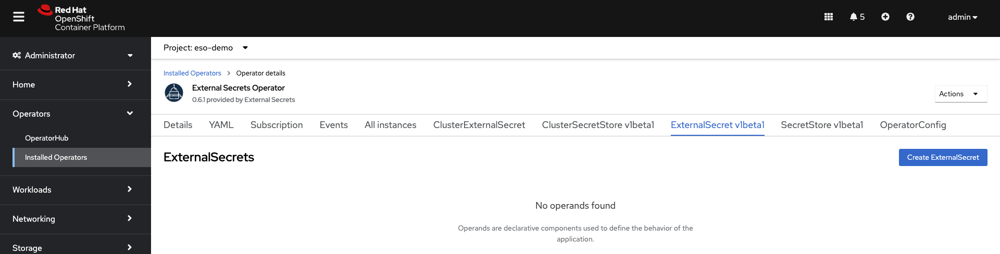

```sh
helm upgrade --install eso-secrets-sync ./eso-secrets-sync -n eso-demo
```

After chart deployment:
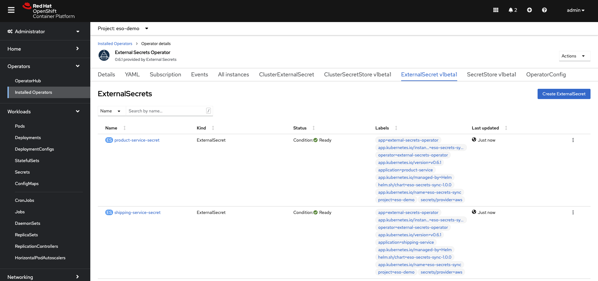

## 2. Validate synchronization of the secrets

Product Service's secrets `{key, value}` pairs generated:


Shipping Service's secrets `{key, value}` pairs generated:
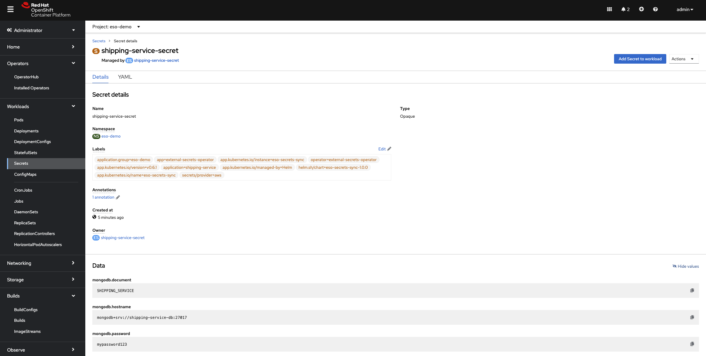

As can be seen, the `secrets` have been successfully created, with content from **AWS Secrets Manager**. The `ExternalSecret` CR also restores `secrets` upon deletion or modification of fetched `{key, value}` pairs. 

Once secrets are synchronized, next steps are to update CI/CD jobs to disable secrets creation, and modify deployment templates to reference our new secrets.

--------------------------------------------------------------------------------------

# IV. Summary

In this guide we've demonstrated how to setup **ESO as a service** on OpenShift with images served from the internal registry. Additionally, we've demonstrated some basic to advanced concepts of Kubernetes package management using Helm, skopeo, oc/kubectl.


# Sources

- [External Secrets Operator Documentation](https://external-secrets.io/v0.6.1/)
- [IAM Policy example for AWS Secrets Manager](https://docs.aws.amazon.com/mediaconnect/latest/ug/iam-policy-examples-asm-secrets.html)
- [Guide Github Repository](https://github.com/luqmanbarry/external-secrets-operator-guide)
- [AWS Secrets Manager](https://docs.aws.amazon.com/secretsmanager/latest/userguide/getting-started.html)
- [OpenShift Registry](https://access.redhat.com/documentation/en-us/openshift_container_platform/4.10/html-single/registry/index#doc-wrapper)

[^1]: <https://external-secrets.io/v0.7.0-rc1/introduction/stability-support/>
